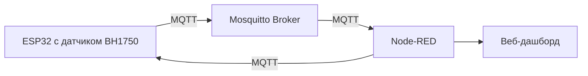

Вот полностью переработанный README.md, который точно соответствует вашему дашборду Node-RED:

markdown
# Система мониторинга освещенности с BH1750 и ESP32

## Архитектура решения


## Установка и настройка
1. Установка Node-RED
```bash
npm install -g --unsafe-perm node-red
node-red
```
Доступ к интерфейсу: http://localhost:1880

2. Установка необходимых нод

В панели управления:

- `node-red-dashboard (веб-интерфейс)`

- `node-red-contrib-aedes (MQTT брокер)`

### Настройка MQTT подключения
1. Создайте брокер в Node-RED:

- Адрес: `192.168.31.110`

- Порт: `1883`

- Client ID: оставьте пустым

2. Топики:

- Входные: `sensors/light`

- Выходные:

    - `light/control (управление светодиодом)`

    - `display/control (управление дисплеем)`

### Описание потока
Основные компоненты

1. MQTT Input (sensors/light)

    - Подписывается на данные с датчика BH1750

    - QoS: 2 (гарантированная доставка)

2. Функция обработки данных

```javascript
// Пример обработки входящих данных
if (value < 100) {
    return "ON"; // Включить светодиод
} else {
    return "OFF"; // Выключить светодиод
}
```
3. Визуальные элементы Dashboard:

- `ui_gauge` - аналоговый индикатор освещенности (0-1000 lx)

- `ui_chart` - график изменения освещенности

- `ui_text` - текстовое отображение значений


### Логика работы

1. При получении данных:
    
    - Проверка корректности значений
        
    - Преобразование в 7 различных форматов для:
        
        - Визуализации
            
        - Логирования
            
        - Управления устройствами
            
2. Автоматическое управление:
    
    - Светодиод включается при освещенности < 100 lx
        
    - Дисплей переключается в ночной режим при < 300 lx
        

## Веб-интерфейс

Доступ к дашборду: `http://localhost:1880/ui`

Содержит следующие элементы:

1. Основной индикатор освещенности
    
2. График изменений
    
3. Текстовые показания с временной меткой
    
4. Статусные панели:
    
    - Состояние светодиода (цветовая индикация)
        
    - Режим дисплея (дневной/ночной)
        

## Настройка ESP32

Убедитесь, что ESP32 публикует данные в формате:


```arduino
client.publish("sensors/light", String(lux).c_str());
```

## Возможные проблемы и решения

1. **Нет данных в Dashboard**:
    
    - Проверьте подключение MQTT
        
    - Убедитесь, что ESP32 публикует в правильный топик
        
2. **Некорректные значения**:
    
    - В функции обработки добавлена проверка `isNaN()`
        
    - Логируются все ошибочные значения
        
3. **Задержки данных**:
    
    - Увеличьте `keepalive` в настройках MQTT
        
    - Проверьте стабильность WiFi соединения